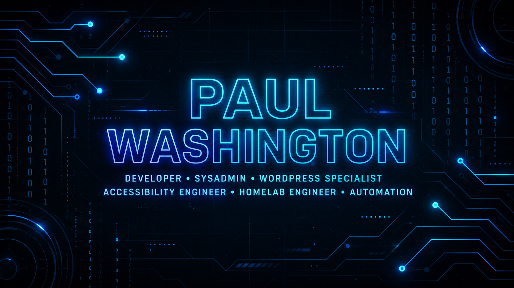

  

# 👋 Hi, I'm Paul Washington  
### Developer • SysAdmin • WordPress Specialist • Homelab Engineer • Pastor

I build systems — digital, operational, and spiritual.  
I'm an Application Developer with the State of Missouri, an Associate Pastor at Grace Covenant Church of Mid Missouri, and the owner/developer behind **Grace Community Multi Media**, **Raes Appliance Repair**, and **ReTechX**.

My passion is using technology to solve real problems for communities, churches, and small businesses.

---

## 🚀 What I Do

### 🧠 **Software & Web Development**
- Full-stack JavaScript (Node.js, React/Next.js)
- WordPress custom development (themes, components, branding)
- REST API design and workflow automation
- Documentation architectures using MkDocs + Material

### 🧰 **Infrastructure & Automation**
- Ubuntu Server administration  
- Docker & containerized environments  
- Cloudflare Zero-Trust networking  
- Postgres + NocoDB backend systems  
- n8n automation workflows (CSV pipelines, content generation, cloud storage automation)

### ✝️ **Ministry Technology & Leadership** 
- Sermon research, organization, and content development  
- Ministry technology (media, livestreaming, digital systems)
- Building tools that help pastors and churches operate effectively

---

## 🛠️ Tech & Tools I Use

### **Languages & Frameworks**
- JavaScript / TypeScript  
- Python  
- Bash  
- PHP (WordPress)  
- React / Next.js  
- Node.js  

### **Systems & Infrastructure**
- Ubuntu Server, OpenMediaVault, KVM  
- Docker + Docker Compose  
- Postgres, SQLite  
- Cloudflare Zero Trust  
- NocoDB  
- VS Code  

### **Automation & DevOps**
- n8n  
- GitHub Actions (coming soon)  
- Shell scripting  
- System provisioning & workstation setup  

---

## 📂 Featured Work (in progress & coming soon)

### 🏢 **Infrastructure / DevOps**
- **Infrastructure**  
  Dockerized self-hosted environment for automation, databases, and development tools.

- **Workstation Setup Scripts**  
  Automated provisioning toolkit for my development workstation(s).

- **n8n Automation Pipelines**  
  AI-assisted CSV creation, Google Drive automation, and content-generation pipelines.

---

### 🛒 **Systems**
- **Warehouse Management System (WMS)**  
  Full-stack inventory and barcode platform for electronics refurbishing.

---

### 🖥️ **Web & WordPress Development**
- WordPress component library  
- Custom theme and UI development  
- Gradient/UI branding systems  
- Performance & security hardening scripts  

---

## 🎓 Certifications
- **CompTIA Security+ (Expired)**  
- **Certified Ethical Hacker (CEH) (Expired)**  
- **Splunk Core Certified User**  
- Additional IT, security, and ministry leadership training

---

## 🌱 Currently Learning
- Advanced Next.js full-stack patterns  
- Scalable automation pipelines  
- OSINT tools and investigation workflows  
- Pastoral counseling and discipleship development  
- Improving documentation systems with MkDocs

---

## 🤝 Connect with Me

- 💼 **LinkedIn:**  
  [linkedin.com/in/pastor-paul-washington-473961151](https://www.linkedin.com/in/pastor-paul-washington-473961151/)

- 🔧 **ReTechX Electronics Refurbishing:**  
  [eBay Store](https://www.ebay.com/usr/retechxofficial)

- 💬 **Discord:**  
  

---

Thanks for visiting — always building, always learning, always serving. 🙌
